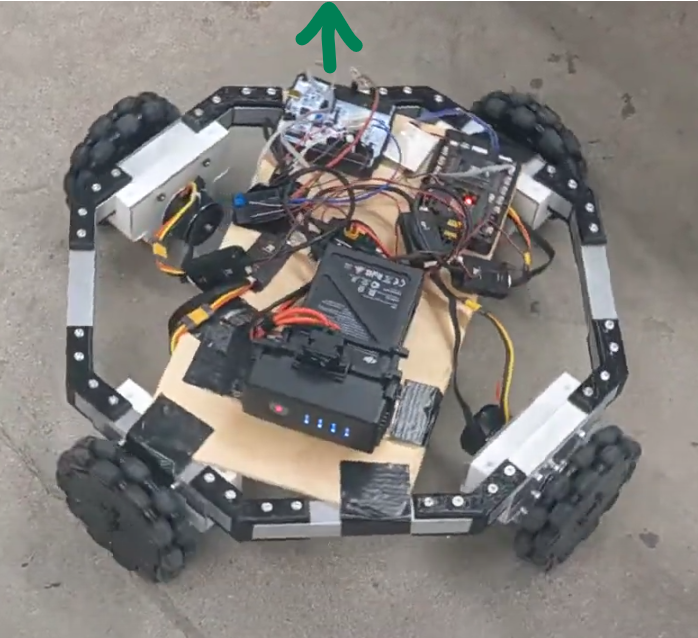

# Week 3 - Codebase Structure, Chassis, and Gimbal

While the previous two weeks have covered general background knowledge (with the exception of the IMU assignment), this week, and the weeks going forward will be TR-specific. This week, we will be going over how the Embed codebase is structured, and then doing a deep dive into the chassis and turret logic. 

## Broad Structure

The embed codebase can be broadly categorized into 2 main categories: subsystems and utilities. Subsystems are generally higher-level functions of the robot, such as driving and shooting logic, and conversely, util deals with the lower-level parts of the robot, such as comms, sensors, controls, and algorithms. While this week will be focusing on subsystems, each subsystem ultimately depends on various utilities to function.

Additionally, you should be aware that we have our actual runtime logic in a robot specific implementation file (.cpp). For this training, we'll only have infantry.cpp, but in the garage you have two other robots to worry about, hero and sentry. The differences between the robots aren't relevant right now, but you can think of infantry as the "base robot" (not to be confused with the actual baserobot.h), and the other two as variations of it. Also, we commonly refer to this implementation file as "main", so later on, when I ask you to do something in main, just be aware that I'm talking about the infantry.cpp file. If you're confused by why 'main' refers to the runtime logic, that's a vestigal trait of when we used to do all of our logic explicitly in the main() function, rather than just calling our set up and periodic loop like we do today. 

## A Brief Forey into Util-Land

While util is broad, there's a few key parts that you should be familiar with before starting with chassis and gimbal logic. Let's go function by function

### Orientation 


When it comes to orientation, you should already be familiar with one half of it: the IMU. The IMU is responsible for estimating the pitch and yaw of the robot's head, and its complement is the encoder, which estimates yaw for the chassis. Although it may seem redundant to measure yaw from both the head and the chassis, the reason is that the head needs to be able to operate fully independently of the chassis, since during our competetion, we often beyblade to make our armor panels harder to hit. 


Additionally, knowing the difference between the turret-yaw and chassis-yaw allows for drive modes such as yaw-oriented, which moves relative to where the head is looking, and yaw-aligned, which lines up the wheels with the direction the turret is looking. 

Also, there are some nuances between the encoder's absolute yaw and the IMU's (ISM330) relative yaw, but that's beyond the scope of this training. Ask your lead for details if you're curious. 

### Communications

While communications is very broad (I'm sure you're tired of hearing that), and also covers communications with the jetson (Auto's computer), and the referee system, for our purposes we're only worried about the controller.


The controller operates similarly to a videogame controller: the left-stick handles the chassis movements, and the right-stick controls the turret; however, there are a few key exceptions. The first is that to turn it on, you have to tap and hold the power button. Also the switch in the center controls your drive-mode, C is neutral, N is typically yaw-oriented, and S is beyblade. 

Additionally, although you won't be using these functions for quite some time, you should be aware that the center-left button controls the flywheels, which are responsible for launching the balls, and the right trigger/camera button is what shoots the balls. Additionally, the small button on the top-right is responsible for unjamming.

Also, this should go without saying, but you should turn off the controller whenever it's not in use, since it'll start beeping fairly loudly if you don't. 

Lastly, we'll repeat this warning later, but **be careful when using the controller. Make sure your lead is present at all times as a safety percaution.**

## Controller Logic in main

**Note: "main" here means in the infantry.cpp, as opposed to the logic in the core folder**

Now that you have a good understanding of the controller, it's a good time to start adding some of the controller logic into baserobot (**mini-repo/BaseRobot/**)

In remote read(), under //Driving input, let jx and jy be the left joystick's x-axis reading and y-axis reading respectively. These readings can be obtained from 

```C++
remote_.getJoystickValue(DJIRemote2::Joystick::LEFT_HORIZONTAL); //LEFT_VERTICAL for y-axis; 
                                                                 //RIGHT_VERTICAL and RIGHT_HORIZONTAL can be used for the right stick
```

From there, you should do the same for jyaw and jpitch (right stick x and y axis respectively), and then **restrict all j-variables to the interval [-1,1]** (HINT: Use max and min functions).  

Once you're done with that, head to the periodic function in main (mini-repo/robots/infantry/infantry.cpp), and add the proper drive mode states under //Chassis Logic. For now, just create the states and make them conditional on the remote center switch state (C N S), you don't have to worry about logic yet. Specifically, you should make make a conditional statement where if we have mode N, we should be in `ROBOT_ORIENTED` followed by an else statement that leads to a neutral state. Note that we will come back to this later, and eventually make mode S a dedicated state in week 5. Mode C is dedicated as a neutral state, but we don't explicitly check it in our conditional for safety. (See our note)

You can check the switch state as shown below. 

```C++
remote_.getMode() == DJIRemote2::ModeSwitch::MODE_C; // MODE_N for N, MODE_S for S
```

Note: we only want the robot to be in an operational mode if and only if we explicitly command it to. If the robot were to go into neutral ONLY when given the mode C signal, then it'd remain active if our signal were to be corrupted or noisey, which for obvious reasons is a safety hazard. As such, we use an else statement as a catch-all for any signal that isn't explicitly N or S. 
## Motors 

While we've been skimming over the parts of util, **the motors are integral to your assignment this week.**

There's 3 kinds of motors we use, as shown below. 

| GM6020               | M3508                                         | M2006                                         |
| -------------------- | --------------------------------------------- | --------------------------------------------- |
|  |  |  |

The GM6020s are mainly used for pitch/yaw, the M3508s are mainly used for the wheels, and M2006s are used for flywheels. 

Beyond each motor having different mechanical properties, you should be aware that the motor ID for the GM6020's is shifted forward by 4, as shown by the table below. 

| True ID | 1   | 2   | 3   | 4   | 5 | 6 | 7 | 8 | 9   | 10  | 11  | 12  |
| ------- | --- | --- | --- | --- | - | - | - | - | --- | --- | --- | --- |
| M3508   | 1   | 2   | 3   | 4   | 5 | 6 | 7 | 8 | DNE | DNE | DNE | DNE |
| M2006   | 1   | 2   | 3   | 4   | 5 | 6 | 7 | 8 | DNE | DNE | DNE | DNE |
| GM6020  | DNE | DNE | DNE | DNE | 1 | 2 | 3 | 4 | 5   | 6   | 7   | DNE |

Additionally, as a reminder, motors with the same true ID shouldn't be on the same CAN bus, although there are two CAN busses on the robot, so you should be aware if your particular motor is meant to be on `CANBUS_1` or `CANBUS_2`. 

### Setting IDs for Motors

Although you shouldn't have to set any motor IDs, for completeness, here is the procedure to do so.

For M3508 or M2006s, you push the button on the ESC once, and then tap out your desired ID. For instance, if you want to set motorID 3, you would press the button once, and then follow it with 3 quick presses. 

For the GM6020s, there are 4 binary switches, and the first 3 encode the ID from 1-7 (0 is invalid), and the last switch controls a CAN resistor. 

### DJI Motor class

The constructor for the class is as follows: 

```C++
DJIMotor(short motorID, CANHandler::CANBus canBus, motorType type, const std::string& name);
```

For instance, if we wanted to create a back-left M3508 named LB, with ID 2 on canbus 1, we would have the following:

```C++
DJIMotor LB(2, CANBUS_1, M3508, "LeftBack");
```

Once you've created the motor object, there's 3 different ways to set some output.

``` C++
setPower(int Power); // M3508 and M2006 range from +/- 16384, GM6020 is +/- 32767 
setSpeed(int RPM); 
setPosition(int ticks); // The motors encode 360 degrees as 8192 ticks, so each tick is roughly 0.044 degrees.
```

You should be aware that while setPower is just a raw current input (ranging from -20A to 20A), setSpeed and setPosition rely on a PID. While the details of PID will be explained more in the next week, a simple definition is that its a tuning algorithm that we run in software to standardize the outputs of each motor, since each individual motor has small differences that we have to account for. For example, one M3508 might run at 10 RPM from 1A, whereas another might run at 11RPM from 1A, and so each motor's PID accounts for that and standardizes them. 

Also, once you've set the proper output, you send it with `s_sendValues();`.

### Motor Debugging

While you likely won't need this for the assignment, you should be familiar with testing and debugging motors, since it comes up fairly frequently. Here are the relevant functions. 

`LB.getData(ANGLE)` Returns angle in ticks with rollover (i.e. resets after a 360).

`indexer.getData(MULTITURNANGLE)` Returns angle without rollover. 

`LB.getData(VELOCITY)` Returns angular velocity in RPM.

`LB.getData(TORQUE)` Returns torque counts, which can be converted to Newton-meters w/ a constant (don't worry about this for now)

`LB.getData(TEMPERATURE)` Temp in C.

`indexer.getData(POWEROUT)` Returns the power you're sending out to the motor.

## Motor Assignment 

Given last weeks assignment, we trust that you understand and can reliably use constructors, so we're going to skip ahead to actually using the DJI motor class. What we want you to do is head to ChassisSubsystem.cpp (mini-repo/core/subsystems), and implement the setWheelSpeeds function. Make sure to set the desiredWheelSpeeds class variable to wheel speeds, and then for now set each motor's speed directly through setSpeed(). 

Aditionally, now that you can set motor power, implement the logic for your "neutral" state in main. 

## Chassis Subsystem

While there are a number of files in the subsystems folder, it all boils down to two things: chassis logic and turret logic. However, before we can start thinking about the logic, we have to first understand our mechanical design. 

To start with, the wheels we use are mecanum wheels that allow for omnidirectional movement (forward, backward, left, and right).

 

These wheels are placed in a X pattern, so that we also have the ability to rotate the robot clockwise and counterclockwise. Assume that all positive values will result in clockwise rotation, and conversely all negative results in counterclockwise rotation. From this you should be able to figure out what combination of positive and negative motor inputs should result in forward, backward, left and right movement. (Hint: Draw out a diagram and take the sum of the velocity vectors of each wheel. Note that we are assuming some familiarity with mechanics/vectors, but if you haven't taken those classes yet, contact your embed lead). 

Once you feel comfortable in understanding how the driving logic works, head to main (mini-repo/robots), and assign `des_chassis_state.vX` and `des_chassis_state.vY` to `max_linear_vel * jY` and `max_linear_vel * jX` respectively (note: vX = constant*jY is indeed counter-intuitive but that's just our convention).  

Then, implement your driving logic under //Chassis Logic, remember that mode N should correspond to `ROBOT-ORIENTED`. 

Hint: Use this function from Chassis subsystem 

```C++
float ChassisSubsystem::setChassisSpeeds(ChassisSpeeds desiredChassisSpeeds_, DRIVE_MODE mode)
```

## Turret Subsystem

Now that we have our basic Chassis subsystem done, let's start taking a look at our turret logic. The good news is that it's relatively analagous to our previous work with the chassis, except fortunately for us, its actually simpler. 

At this point I would like to challenge you to read the header file for the turret subsystem, and try to piece together and understand how it should function (and I also challenge you to find the file yourself, I believe in you). As a member, you'll often have to go through other people's code, and try to decipher how it works, since while I can always explain it to you if you ask, it's obviously beneficial to be able to problem-solve for yourself. 

Once you've read through the header, try going through the .cpp and fixing all the TODOs. It's not uncommon for you as a member to be told to fix the issues in a particular file where I've gone through and added "TODO" comments throughout. During this process, you are bound to get stuck. In fact, it is my goal for you to get stuck here, and ask for help, because that is the reality of embed. However, it is not my goal to demoralize you or make you frustated, rather I want you to become more comfortable asking for help and collaborating with a lead or TA through an issue, since that has been how I have personally learned a lot of the codebase. Also, don't be afraid to contact your fellow recruits during this process either, you will eventually be partnered into a capstone, so reach out and get to know each other. Lastly, it's not the end of the world if you make a mistake here, the point is to make mistakes and learn from them. 

Once you have fixed the TODOs in the .cpp file, add your logic to the drive states you have in the main periodic function. Consider when you want the turret sleeping and when you want it active. Additionally, above (TODO: Add this part after we add main) complete the TODO for yaw_desired_angle and pitch desired angle. 

