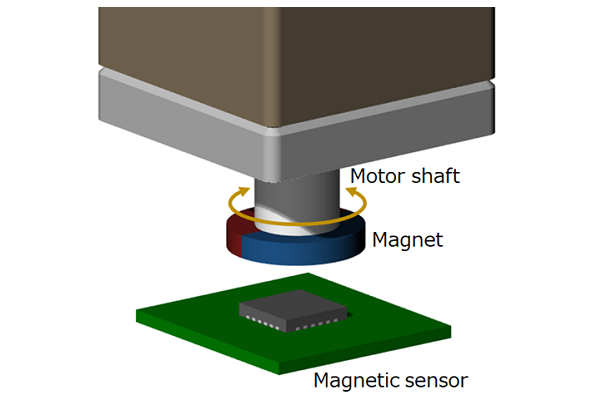

# Week 5: Integration

I hope you enjoyed last week, now it's back to my writing style - Dil 

Over the past few weeks, you've slowly built up your own mini-embed repo, and now its time to put it all together. Our goal for this week is to be able to do yaw-oriented drive, meaning that the robot can move relative to where the head is looking. 

At a fundamental level, this process just comes down to figuring out where we're looking, and then adjusting our motor power based off that, and while we could skip directly to the assignment, we want to discuss some systems-level understanding. More specifically, while you've had some practice being what we call "implementation monkey", this week is more about approaching a problem more analytically: first by understanding your hardware, deciding how you want to use it, modelling your problem mathematically if possible, and then finally implementing your model/solution. 

## IMU Yaw vs Encoder Yaw

Although we had you implement the BNO055 in week 2, we never went over the details and limitations associated with using an IMU. At its core, an IMU only measures acceleration and angular velocity, not orientation. As a result, we have to integrate our angular velocity to get some estimate of yaw, except as you might know from calculus, integrating velocity produces displacement, or in our case relative yaw, rather than true, absolute yaw. Additionally, since we're using numerical methods to compute this integral, we will eventually have some drift, since we're basically taking glorified riemann sums. 

The encoder, on the other hand, measures rotation between the chassis and head by actually physically rotating around a magnet (see the figure). Our encoder reads the magnetic field from the magnet, and as it rotates, the magnetic field varies, meaning that the encoder returns an absolute measurement, specifically the delta yaw from the head and the chassis. Additionally, since we're directly reading from the magnet and not relying on numerical methods, we also don't run into any drift. All of this is to say that the encoder, is clearly more accurate than the IMU, and so whenever we're given the choice, we should choose to rely more on the encoder. 

As an aside, you might now be wondering: "If the encoder really is so much more accurate than the IMU, why bother with the IMU at all?". The answer is that while the IMU's yaw is less accurate and drifts, it is head relative, so it's helpful for auto's CV pipeline to know exactly where the head is looking, even if that is relative to some arbitrary 0 angle at start up. Additionally, it also measures pitch very accurately (the reason is because the gravity vector helps us account for drift in our pitch calculations), which is also very helpful for auto.

## Understanding Yaw-Oriented Drive

With that discussion done, I now hope you have some idea of how we're going to go about yaw-oriented drive. Namely, you should be asking yourself the following two questions

1. Which sensor is better suited for getting this done? IMU or Encoder?

2. Do I even need both or is one sufficient for what I need to do? 

Give yourself some time to think about the second question. It's okay if you can't fully answer it, the important part is trying to reason about it. 

The answers are that 

1. Encoder, since its much more accurate and doesn't drift.

2. Surprisingly, for yaw-oriented drive, we only need the encoder, the IMU, like we discussed is much better suited for turret applications, and the encoder gives us the exact measurement we need: the delta between chassis orientation and head orientation. 

Now that we've done a lot of the systems-level yap, let's get to understanding some of the math involved.

Let's say that we have some delta $\theta$ between the chassis and turret, how can we account for that in our drive mode? 

For those of you who have taken linear algebra, the answer should be trivial, we use the rotation matrix. Now if you haven't taken the class yet, you really should watch this  3Blue1Brown [video](https://www.youtube.com/watch?v=kYB8IZa5AuE&list=PLZHQObOWTQDPD3MizzM2xVFitgF8hE_ab&index=3), it's only 10 minutes long and will get you up to speed. If you don't bother, for now just know that matrices allow us to encode rotations mathematically, as well as other kinds of linear transformations. 

So, now that we know that, all we have to do is some simple matrix multiplication to find our rotated vX and vY, which we'll write as vX' and vY':

$$ \begin{pmatrix} v_X' \\ v_Y' \end{pmatrix} = \begin{pmatrix} \cos\theta & -\sin\theta \\ \sin\theta & \cos\theta \end{pmatrix} \begin{pmatrix} v_X \\ v_Y \end{pmatrix}.$$

Which simplifies to:
$$ v_X' = v_X\cos\theta - v_Y\sin\theta $$
$$ v_Y' = v_X\sin\theta + v_Y\cos\theta . $$

If you look in the code, these are the exact outputs of our rotateChassisSpeed function. 

## Implementing Yaw Oriented Drive

Ok, now time to actually implement Yaw-Oriented drive. The first step is to go into the chassis subsystem, and go thru the TODO I've placed, which outline the structure (it should only be a few lines of code). Then, go into infantry.cpp and put in the yaw oriented mode, along with some run time logic. **REMEMBER TO INCLUDE** `des_chassis_state.vOmega = 0;`, and also that desired turret state should be set to aim. Feel free to go back and reference week 3 if you're confused. 