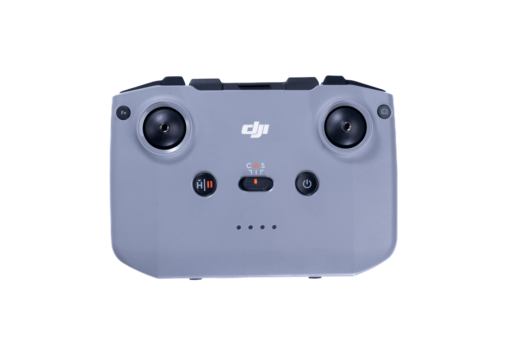
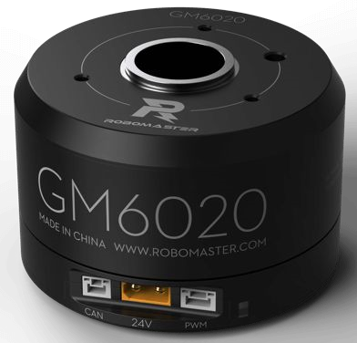
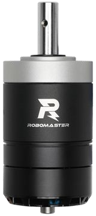
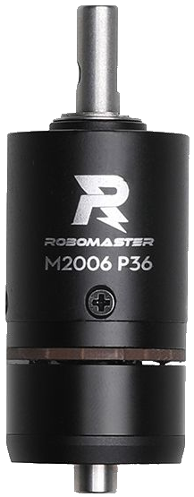

# Week 3 - Codebase Structure, Chassis, and Gimbal

While the previous two weeks have covered general background knowledge (with the exception of the IMU assignment), this week, and the weeks going forward will be TR-specific. This week, we will be going over how the Embed codebase is structured, and then doing a deep dive into the chassis and turret logic. 

## Broad Structure

The embed codebase can be broadly categorized into 2 main categories: subsystems and utilities. Subsystems are generally higher-level functions of the robot, such as driving and shooting logic, and conversely, util deals with the lower-level parts of the robot, such as comms, sensors, controls, and algorithms. While this week will be focusing on subsystems, each subsystem ultimately depends on various utilities to function.

## A Brief Forey into Util-Land

While util is broad, there's a few key parts that you should be familiar with before starting with chassis and gimbal logic. Let's go function by function

### Orientation 

When it comes to orientation, you should already be familiar with one half of it: the IMU. The IMU is responsible for estimating the pitch and yaw of the robot's head, and its complement is the encoder, which estimates yaw for the chassis. Although it may seem redundant to measure yaw from both the head and the chassis, the reason is that the head needs to be able to operate fully independently of the chassis, since during our competetion, we often beyblade to make our armor panels harder to hit. 

TODO: Include gif of beyblade

Additionally, knowing the difference between the turret-yaw and chassis-yaw allows for drive modes such as yaw-oriented, which moves relative to where the head is looking, and yaw-aligned, which lines up the wheels with the direction the turret is looking. 

Also, there are some nuances between the encoder's absolute yaw and the IMU's (ISM330) relative yaw, but that's beyond the scope of this training. Ask your lead for details if you're curious. 

### Communications

While communications is very broad (I'm sure you're tired of hearing that), and also covers communications with the jetson (Auto's computer), and the referee system, for our purposes we're only worried about the controller.



The controller operates similarly to a videogame controller: the left-stick handles the chassis movements, and the right-stick controls the turret; however, there are a few key exceptions. The first is that to turn it on, you have to tap and hold the power button. Also the switch in the center controls your drive-mode, C is neutral, N is typically yaw-oriented, and S is beyblade. 

Additionally, although you won't be using these functions for quite some time, you should be aware that the center-left button controls the flywheels, which are responsible for launching the balls, and the right trigger/camera button is what shoots the balls. Additionally, the small button on the top-right is responsible for unjamming.

Also, this should go without saying, but you should turn off the controller whenever it's not in use, since it'll start beeping fairly loudly if you don't. 

Lastly, we'll repeat this warning later, but **be careful when using the controller. Make sure your lead is present at all times as a safety percaution.**

## Motors 

While we've been skimming over the parts of util, **the motors are integral to your assignment this week.**

There's 3 kinds of motors we use, as shown below. 

| GM6020               | M3508                                         | M2006                                         |
| -------------------- | --------------------------------------------- | --------------------------------------------- |
|  |  |  |

The GM6020s are mainly used for pitch/yaw, the M3508s are mainly used for the wheels, and M2006s are used for flywheels. 

Beyond each motor having different mechanical properties, you should be aware that the motor ID for the GM6020's is shifted forward by 4, as shown by the table below. 

| True ID | 1   | 2   | 3   | 4   | 5 | 6 | 7 | 8 | 9   | 10  | 11  | 12  |
| ------- | --- | --- | --- | --- | - | - | - | - | --- | --- | --- | --- |
| M3508   | 1   | 2   | 3   | 4   | 5 | 6 | 7 | 8 | DNE | DNE | DNE | DNE |
| M2006   | 1   | 2   | 3   | 4   | 5 | 6 | 7 | 8 | DNE | DNE | DNE | DNE |
| GM6020  | DNE | DNE | DNE | DNE | 1 | 2 | 3 | 4 | 5   | 6   | 7   | DNE |

Additionally, as a reminder, motors with the same true ID shouldn't be on the same CAN bus, although there are two CAN busses on the robot, so you should be aware if your particular motor is meant to be on `CANBUS_1` or `CANBUS_2`. 

### Setting IDs for Motors

Although you shouldn't have to set any motor IDs, for completeness, here is the procedure to do so.

For M3508 or M2006s, you push the button on the ESC once, and then tap out your desired ID. For instance, if you want to set motorID 3, you would press the button once, and then follow it with 3 quick presses. 

For the GM6020s, there are 4 binary switches, and the first 3 encode the ID from 1-7 (0 is invalid), and the last switch controls a CAN resistor. 

### DJI Motor class

The constructor for the class is as follows: 

```C++
DJIMotor(short motorID, CANHandler::CANBus canBus, motorType type, const std::string& name);

```


Additionally, you can grab the following data from a motor. In this case, let's say we have a motor named LB (left-back). 

`LB.getData(ANGLE)` Returns angle in ticks with rollover (i.e. resets after a 360). Note that there are 8192 ticks in a 360, so each tick is roughly 0.044 degrees.

`indexer.getData(MULTITURNANGLE)` Returns angle without rollover. 

`LB.getData(VELOCITY)` Returns angular velocity in RPM.

`LB.getData(TORQUE)` Returns torque counts, don't worry about this for now.

`LB.getData(TEMPERATURE)` Temp in C.


`indexer.getData(POWEROUT)`

## Subsystems

While there are a number of files in the subsystems folder, it all boils down to two things: chassis logic and turret logic. 

The chassis side

